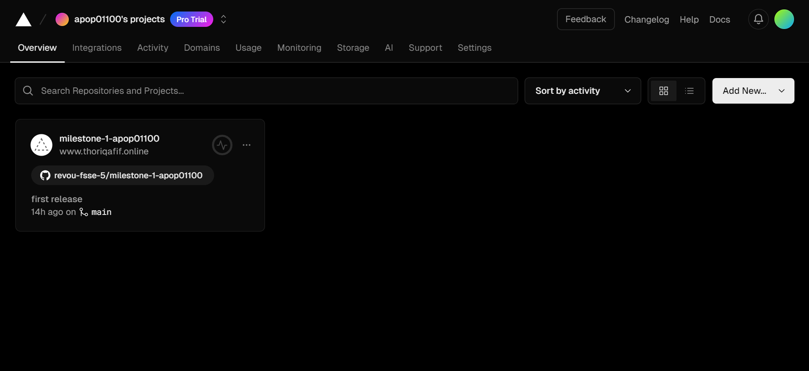
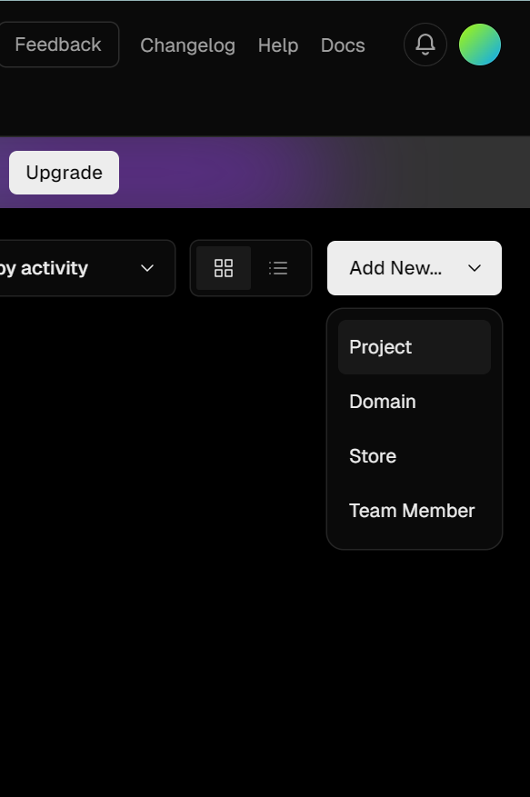
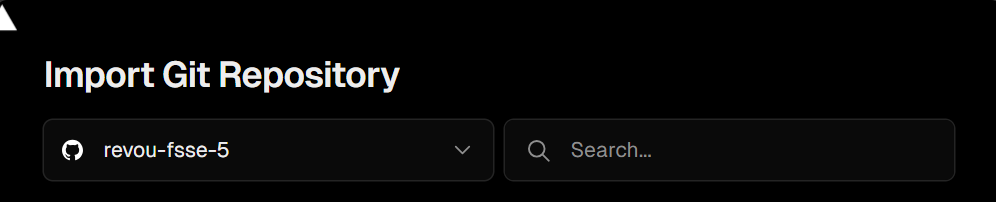
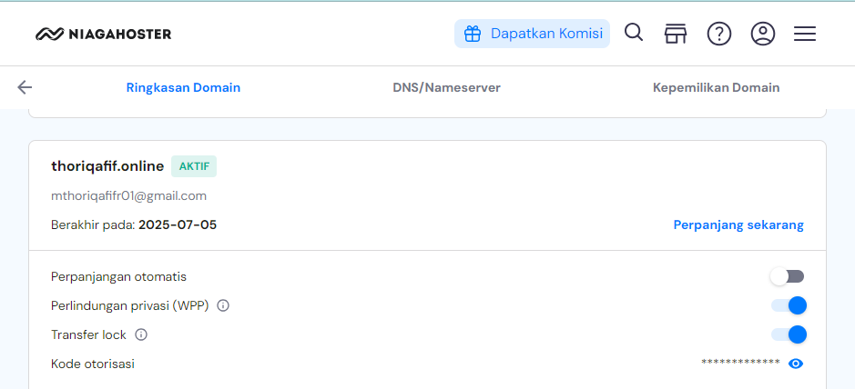
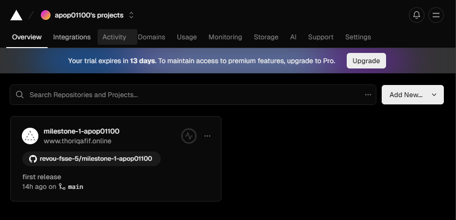
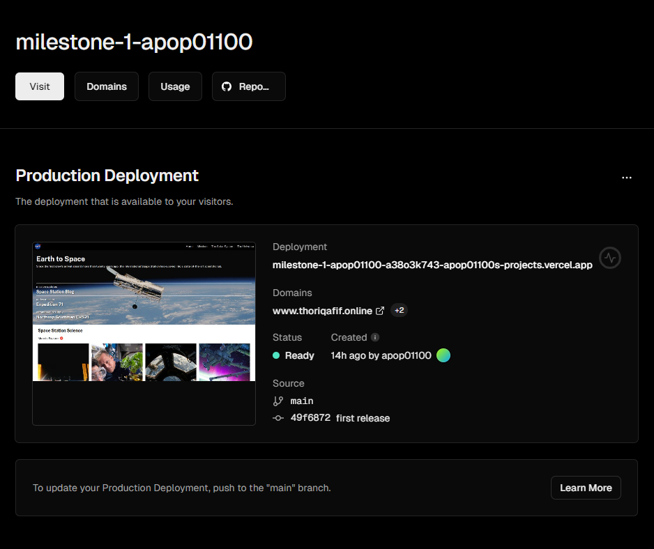
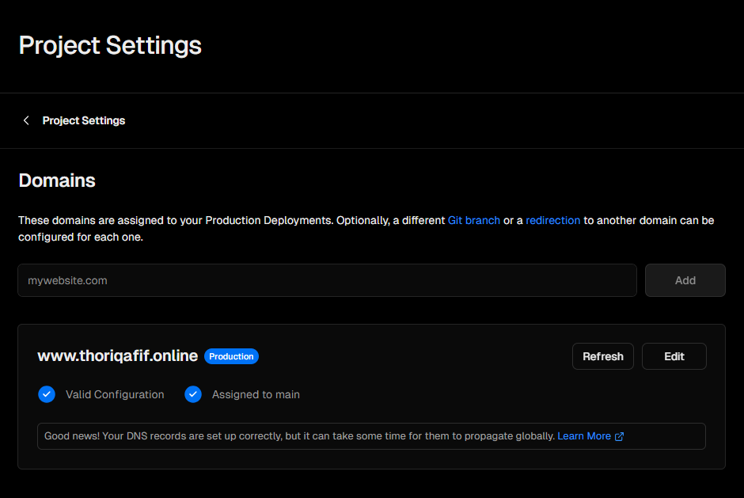
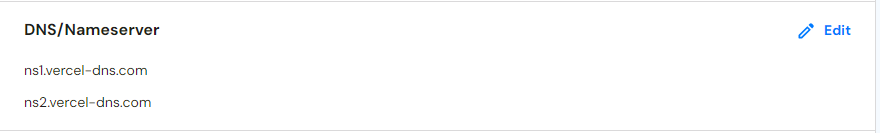
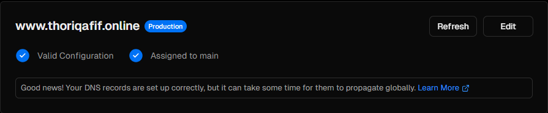

# NASA Clone Website
Welcome to the NASA Website Clone project! This repository contains the source code and assets needed to create a static clone of the official NASA website using only HTML and CSS. The purpose of this project is to provide a simple yet effective example of web development focusing on the structure and styling of a web page.

## STRUCTURE
* Header
    - Navbar

* Main
    - Hero Section
    - Space Station Science Section
    - Earth Information Section
    - Image of The Day Section
    - More NASA Images Section
    - Topics from NASA Section

* Footer

## WHAT I USE?

* HTML

* CSS

* External/Internal Source
    - Goolge fonts
    - icons
    - images

## HOW TO SET UP
This section provides step-by-step instructions on how to push this project to GitHub repository. You will need a GitHub account to clone this repository, make sure you're connected to GitHub.

1. Clone this repository
```
git clone https://github.com/revou-fsse-5/milestone-1-apop01100
```

2. Create a new branch named

    "develop", in this repository we would like to develop the website with personal information.
```
git branch "develop
```

3. Once it's created, checkout to a new branch
```
git checkout "develop"
```

4. Develop and modify the website your personal information, once it's done you wil need to push it
```
git add .
git commit -m "update message" // make sure to give details commit message to get better logs
git push origin develop 
```

5. Once you're done, you can merge into main branch for production build
```
git checkout main
git pull origin main // pull the latest version before commit merge
git merge develop // if there are any conflicts, you should resolve them manually
git commit -m "Merge develop into main"
git push origin main
```
## DEPLOYMENT
The project has been successfully deployed using Vercel. You can access the production version of the website by visit this link: https://www.thoriqafif.online/.

1. Connect your account to Vercel

The first step to deploy this project in Vercel is createing a new account or use existing account. As a beginner programmer, I would prefer using GitHub account instead. 

After you successfully login, you wil be redirected to dashboard of Vercel app like this:

    

In thise case, I already import the project from GitHub to Vercel. So if you want to import your existing project from GitHub, you can "Add New Project" like this:

    

And then import your GitHub repository in here:

    

2. Domain Register with NiagaHoster
    
    Go to https://niagahoster.co.id and log in or create a new account. Check available domain that you wanted and make it yours.

    After you login and have a domain for your project, you will b redirected to this pages:

    

3. Modify your project with customize domain
    
    Go to dashboard Vercel -> Choose The Project -> Domain :

    Dashoboard Verchel
    

    The Project
    

    Select Domain
    

    Import your customize domain, and make sure DNS/Nameserver in NiagaHoster same in Vercel. You can setting DNS/Nameserver Niagahoster in same page Niagahoster domain above:
    

4. Congartulaitons, Your's done!

    You should wait within 1x24 hours to let the NiagaHoster setting up the DNS, it could be faster or slower depending on the provider internet that you're using. If you success in this step, the output will be  like this in your Vercel project domain:
    


